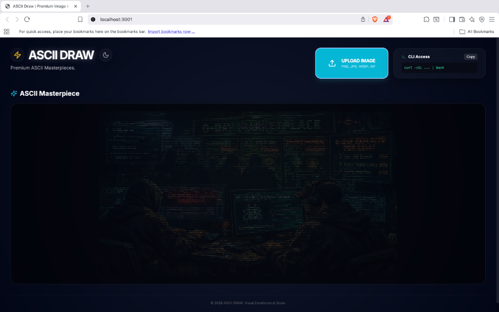

# ASCII Draw



Premium engine for transforming images into beautiful, colored ASCII art across Web and Terminal.
 It provides a stunning web interface and a seamless terminal integration for creating colorized ASCII masterpieces.

## 🌟 Features

- **Premium Web UI**: Minimalist, glassmorphic design built with Next.js and Tailwind CSS.
- **Terminal Integration**: native support via `curl | bash` for macOS, Linux, and Windows.
- **24-bit TrueColor**: Accurate color reproduction for both web and terminal outputs.
- **Enterprise-Grade Security**: Strict image parsing using `sharp` to prevent RCE and malicious file execution.
- **Performance Optimized**: Server-side processing with efficient data streaming.

## 🛠 Prerequisites

- **Node.js**: `v18.17.0` or higher (tested on Node 25).
- **Package Manager**: `npm` or `yarn`.

## 🚀 Getting Started

### 1. Installation

Clone the repository and install dependencies:

```bash
git clone <repository-url>
cd asciidraw
npm install
```

### 2. Local Development

Start the development server:

```bash
npm run dev
```

Open [http://localhost:3000](http://localhost:3000) to view the application.

### 3. Usage Guide

#### Web Interface

1. Drag and drop any image (PNG, JPG, WEBP, GIF) onto the upload zone.
2. The image is validated and processed on the server.
3. Your ASCII art appears instantly in the "Masterpiece" section.

#### Terminal Interface (Universal)

You can use `curl` from any terminal on any operating system to instantly transform images. Run the following command:

```bash
curl -sSL http://localhost:3000/api/convert | bash
```

### 💻 OS Guidance

- **🍎 macOS**: Use the default **Terminal** app. It will open a native Finder picker.
- **🐧 Linux**: Works in any shell (bash, zsh). Ensure `zenity` or `kdialog` is installed for a GUI picker.
- **🪟 Windows**: Use **Git Bash** (recommended) or **WSL**.
  - *Note*: Standard CMD/PowerShell users should use Git Bash to support the pipe-to-bash workflow. This will trigger the native Windows File Explorer.

---

> [!TIP]
> If a GUI file picker isn't available, the script will automatically prompt you to type the file path manually.

## 🧪 Testing

We maintain high code quality through linting and build validation.

- **Linting**:

  ```bash
  npm run lint
  ```

- **Build Verification**:

  ```bash
  npm run build
  ```

## 🚢 Deployment

### Deploy to Vercel (Recommended)

The easiest way to deploy is using the Vercel Platform:

1. Push your code to GitHub.
2. Connect your repository to Vercel.
3. Vercel will automatically detect Next.js and deploy.

### Manual Deployment

```bash
npm run build
npm run start
```

## 🔒 Security

- **Strict Validation**: Files are processed as buffers and parsed by `sharp`. Only standard image headers are accepted.
- **DOS Protection**: Image dimensions are capped at 4000x4000 pixels.
- **Size Limits**: API routes enforce a 5MB payload limit.

## ⚖️ License

Distributed under the MIT License. See `LICENSE` for more information.
